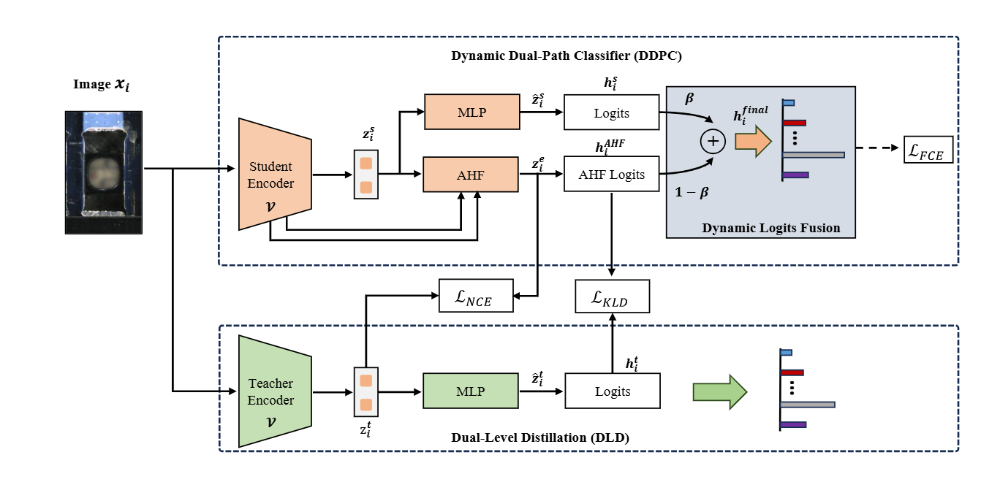

# LED-DDNet: A Lightweight Dual-Path Approach for LED Defect Recognition via Dynamic Distillation

The manuscript has been submitted to The Visual Computer.

# Lightweight Dual-Path Network with Dynamic Distillation for Industrial LED Defect Recognition

<p align="center">
  
</p>

<p align="center">
Overview of the proposed Dynamic Dual-Path Classification and Dual-Level Distillation framework.
</p>

---

## Introduction

Industrial LED defect recognition plays a critical role in intelligent manufacturing systems. However, practical deployment faces several challenges, including:

* Imbalanced defect distributions;
* Fine-grained visual similarity among defect categories;
* Limited computational resources on edge devices.

To address these issues, we propose a **Lightweight Dual-Path Network with Dynamic Distillation**, which combines:

* **Dynamic Dual-Path Classifier (DDPC)**
* **Adaptive Hierarchical Fusion (AHF)**
* **Dynamic Logits Fusion (DLF)**
* **Dual-Level Distillation (DLD)**

The proposed framework achieves high recognition accuracy while maintaining lightweight computational complexity.

---

## Network Architecture

### Dynamic Dual-Path Classifier (DDPC)

The DDPC module contains two complementary branches:

1. Global classification branch
2. Adaptive hierarchical fusion branch

The fusion branch aggregates multi-level features extracted from EfficientNet-B0 to enhance fine-grained defect discrimination.

### Dynamic Logits Fusion (DLF)

Instead of using fixed fusion weights, a lightweight gating network dynamically predicts a sample-dependent fusion coefficient:

[
\hat{y} = \beta y_g + (1-\beta)y_a
]

where

* (y_g) denotes logits from the global branch;
* (y_a) denotes logits from the adaptive fusion branch;
* (\beta) is generated dynamically for each sample.

### Dual-Level Distillation (DLD)

Knowledge is transferred from a ResNet50 teacher network to the EfficientNet-B0 student through:

#### Logit-Level Distillation

KL divergence is employed to transfer class-relation knowledge:

[
\mathcal{L}_{KLD}
]

#### Feature-Level Distillation

InfoNCE loss aligns student and teacher representations:

[
\mathcal{L}_{NCE}
]

The overall objective is:

[
\mathcal{L}
===========

\alpha \mathcal{L}*{KLD}
+
\beta \mathcal{L}*{CE}
+
\gamma \mathcal{L}_{NCE}
]

---

## Dataset Structure

Organize the dataset as follows:

```text
dataset/
├── train/
│   ├── class1/
│   ├── class2/
│   └── ...
├── val/
│   ├── class1/
│   ├── class2/
│   └── ...
└── test/
    ├── class1/
    ├── class2/
    └── ...
```

---

## Environment

### Requirements

```bash
Python >= 3.9
PyTorch >= 2.0
Torchvision >= 0.15
NumPy
OpenCV
Scikit-Learn
Matplotlib
Pillow
```

Install dependencies:

```bash
pip install -r requirements.txt
```

---

## Training

Run the following command:

```bash
python train.py \
--data_root dataset \
--batch_size 16 \
--num_epochs 50 \
--k_folds 5
```

### Main Hyperparameters

| Parameter     | Value |
| ------------- | ----- |
| Optimizer     | Adam  |
| Learning Rate | 1e-4  |
| Weight Decay  | 1e-4  |
| Batch Size    | 16    |
| Epochs        | 50    |
| Temperature   | 3     |
| K-Folds       | 5     |

---

## Evaluation

After training, the best model from cross-validation will be selected automatically and evaluated on the test set.

Reported metrics include:

* Accuracy
* Precision
* Recall
* F1-score
* Confusion Matrix

---

## Grad-CAM Visualization

The repository supports Grad-CAM visualization for model interpretability.

Example outputs:

```text
gradcam_sample_1.png
gradcam_sample_2.png
...
```

These visualizations highlight the defect regions used by the model for decision making.

---

## Complexity

| Model           | Params (M) | FLOPs (G) |
| --------------- | ---------- | --------- |
| EfficientNet-B0 | 4.01       | 0.41      |
| Proposed Model  | 5.40       | 0.80      |

The proposed framework maintains lightweight complexity while significantly improving defect recognition performance.

---

## Citation

If you find this repository useful, please consider citing:

```bibtex
@article{zhong2026led,
  title={Lightweight Dual-Path Network with Dynamic Distillation for Industrial LED Defect Recognition},
  author={Zhong, Jiaming and others},
  journal={The Visual Computer},
  year={2026}
}
```

---

## Code Availability

This repository contains the official implementation of the manuscript:

**Lightweight Dual-Path Network with Dynamic Distillation for Industrial LED Defect Recognition**

submitted to *The Visual Computer*.

The code is released to improve transparency, reproducibility, and future research on industrial defect recognition.

---

## License

This project is released under the MIT License.

